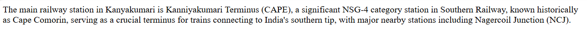
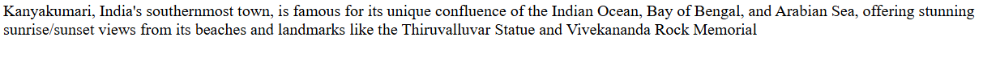
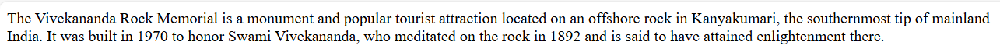
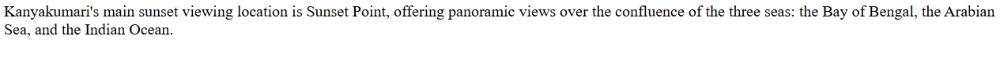
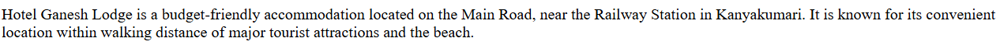

# Ex04 Places Around Me
## Date: 12/12/2025
## Ref no: 25011969 

## AIM
To develop a website to display details about the places around my house.

## DESIGN STEPS

### STEP 1
Create a Django admin interface.

### STEP 2
Download your city map from Google.

### STEP 3
Using ```<map>``` tag name the map.

### STEP 4
Create clickable regions in the image using ```<area>``` tag.

### STEP 5
Write HTML programs for all the regions identified.

### STEP 6
Execute the programs and publish them.

## CODE
~~~
map.html

<html>
<body>
<html><!-- Image Map Generated by http://www.image-map.net/ -->


<map name="image-map">
    <area target="" alt="railway" title="railway" href="railway.html" coords="991,339,1030,374" shape="rect">
    <area target="" alt="beach" title="beach" href="beach.html" coords="1434,388,1501,439" shape="rect">
    <area target="" alt="rockmemorial" title="rockmemorial" href="rockmemorial.html" coords="1499,811,1565,873" shape="rect">
    <area target="" alt="sunsetpoint" title="sunsetpoint" href="sunsetpoint.html" coords="296,777,366,845" shape="rect">
    <area target="" alt="ganeshlodge" title="ganeshlodge" href="ganeshlodge.html" coords="1160,284,1220,327" shape="rect">
</map>
</body>
</html>

railway.html

<html>
<body>
The main railway station in Kanyakumari is Kanniyakumari Terminus (CAPE), a significant NSG-4 category station in Southern Railway, known historically as Cape Comorin, serving as a crucial terminus for trains connecting to India's southern tip, with major nearby stations including Nagercoil Junction (NCJ). 
</body>
</html>

beach.html

<html>
<body>
Kanyakumari, India's southernmost town, is famous for its unique confluence of the Indian Ocean, Bay of Bengal, and Arabian Sea, offering stunning sunrise/sunset views from its beaches and landmarks like the Thiruvalluvar Statue and Vivekananda Rock Memorial    
</body>
</html>

rockmemorial.html

<html>
<body>
The Vivekananda Rock Memorial is a monument and popular tourist attraction located on an offshore rock in Kanyakumari, the southernmost tip of mainland India. It was built in 1970 to honor Swami Vivekananda, who meditated on the rock in 1892 and is said to have attained enlightenment there. 

</body>
</html>

sunsetpoint.html

<html>
<body>
Kanyakumari's main sunset viewing location is Sunset Point, offering panoramic views over the confluence of the three seas: the Bay of Bengal, the Arabian Sea, and the Indian Ocean.
</body>
</html>

ganeshlodge.html

<html>
<body>
Hotel Ganesh Lodge is a budget-friendly accommodation located on the Main Road, near the Railway Station in Kanyakumari. It is known for its convenient location within walking distance of major tourist attractions and the beach. 

</body>
</html>
~~~

## OUTPUT








## RESULT
The program for implementing image maps using HTML is executed successfully.
